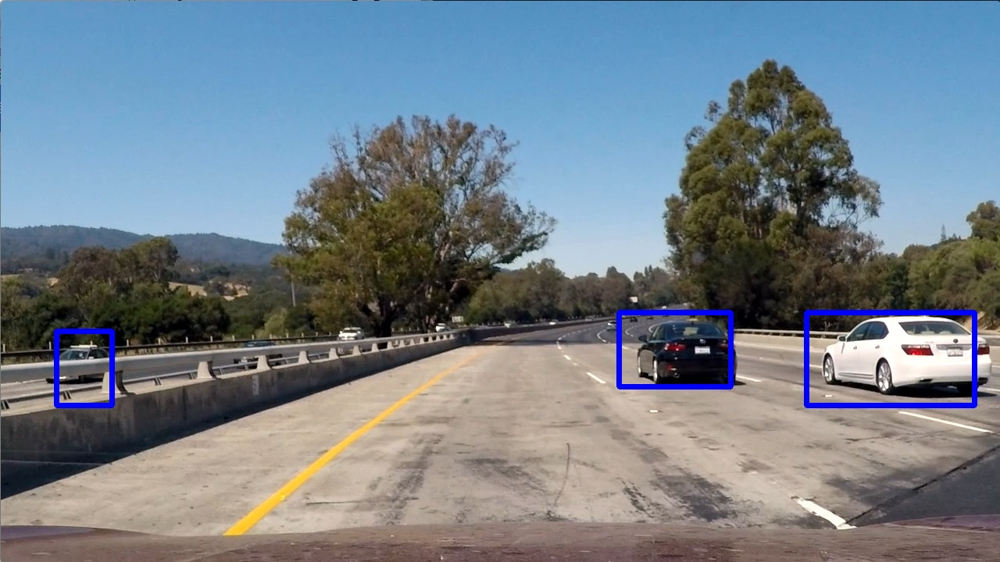
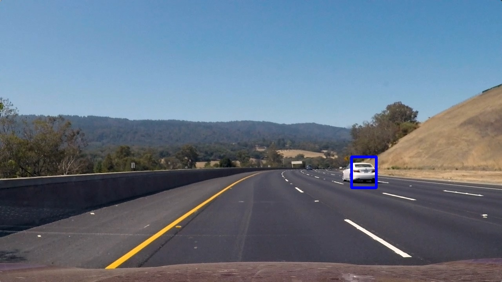
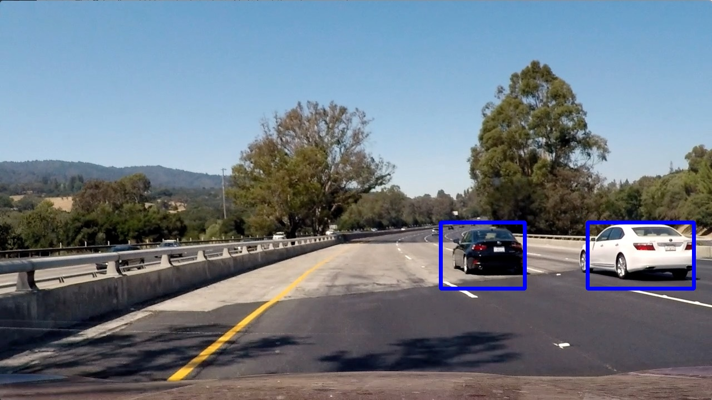
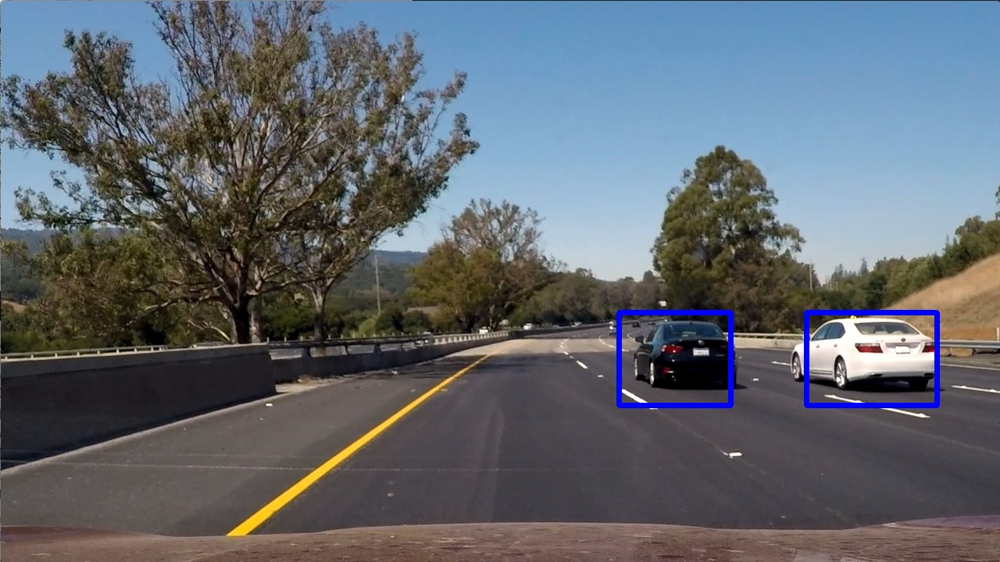

## Project 5 - Vehicle Detection
### Project Goals
- Perform a Histogram of Oriented Gradients (HOG) feature extraction on a labeled training set of images and train a classifier Linear SVM classifier
- Optionally, you can also apply a color transform and append binned color features, as well as histograms of color, to your HOG feature vector.
- Note: for those first two steps don't forget to normalize your features and randomize a selection for training and testing.
- Implement a sliding-window technique and use your trained classifier to search for vehicles in images.
- Run your pipeline on a video stream (start with the test_video.mp4 and later implement on full project_video.mp4) and create a heat map of recurring detections frame by frame to reject outliers and follow detected vehicles.
- Estimate a bounding box for vehicles detected.

---

### Histogram of Oriented Gradients (HOG)

#### Feature Extraction

In order to find object in images, and then detect those images in another picture, a classifier must be trained. For this project, I trained a classifier to extract features of vehicles from images by looking at the histogram of oriented gradients. Using this method, images are broken up into blocks, and each of the blocks contain cells. The cells represent the magnitude and direction of the gradient of the image in that cell's local area. In this way (and by tuning a few parameters), an image can be broken down and features identified by the direction and orientation of the gradients. I perform feature extraction for training in the file "training.py" on lines 20 through 31. The underlying method can be found in the file "lesson_functions.py" on lines 64 through 118.

#### Hog Parameters

My final HOG parameters used the "YCrCb" colorspace, and considered all 3 channels. Through testing, I found that the colorspace was the most useful in creating large gradients at the edges of cars. The Y channel is very similar to grayscale, but appears to have much darker colors at the boundaries of objects. The subsequent Cb and Cr channels are stacked to make the gradient even more pronounced.

Additionally, 9 hog orientations were used, as well as 8x8 pixel cells. The images were spatially binned in 16x16 blocks, and the histograms also had 16 bins. These parameters are the result of several rounds of testing, with the assessment being that smaller cells led to features being missed, and larger cells (and bin counts) leading to very high numbers of false positives. Additionally, the more orientations I allowed, the less my classifier recognized vehicles correctly.

#### Training

I used a Linear SVC classifier for my project, based on the advice from the lesson. It is possible that a Decision Tree could have been useful as well, but the Naive Bayes classifier appeared to oversimplify most problems.

The entire training takes place in the file "training.py." Both the provided vehicle and non-vehicle image sets are loaded, and then used to train the classifier. The sets are randomly shuffled to prevent the order from being taken into account, and a random 20% of the collective image set is split off for training, to prevent overfitting and familiarity of the model to the data. Finally, the trained svc and the X_scaler value are pickled and saved to be loaded by the main pipeline script.

### Sliding Window Search

Once the classifier was trained, it was run against larger images, rather than just small, perfectly sized training data. The image was divided up into blocks, and a sliding window search was implemented. The portion of the image in the current view of the sliding window was then analyzed by the classifier, and that segment of the whole image was labeled as either a vehicle or not a vehicle, based on features found within.

The initial approach was naive, and a second layer had to be applied. Because vehicles could be closer or farther away in an image, and a single size of sliding window might miss features, two separate window scales were used. In each of these scales, the image segment within was scaled to match the size of image the classifier was anticipating. Additionally, performing a HOG operation on every single window was computationally expensive, so it was instead performed on the base image, and then a sliding image search performed on that HOG result.

The sliding window implementation can be found on lines 34 through 65 of "pipeline.py."

### Static Image Pipeline and Optimization

The simplest form of false positive elimination was only considering part of the image. For this, I reviewed the example video and images, and determined that I wanted my pipeline to focus on the areas between 400 and 780 pixels in the Y direction.

To further eliminate false positives, and to allow a single bounding box per vehicle, heat maps were generated on every image. These heat maps were generated based on frequency of car features detected in a specific area of the image. If more features were detected (including between overlapping search windows), the area of the heat map would be brighter. Considering a vehicle to be a contiguous block of "heat" on the map, the outermost coordinates of the largest blocks were used to form a bounding box that was drawn back onto the image. The heat map methods can be found in "pipeline.py" on lines 152 through 177.

Below is an image that was passed through the pipeline, and the corresponding heat map:

The output of the above heat map allows bounding boxes to be drawn on the final image, below.

### Video Implementation

The video generation process is nearly identical to the static image process. Each individual frame of video is run through the same pipeline, and heat mapping is used to weed out false positives and to simplify the set of bounding boxes to one per detected vehicle.

My video result can be [found here.](./video_out.mp4)

Additionally, a few heat maps and their respective output frames can be seen below:

### Reflection

My pipeline performed reasonably well on both static images and video frames. That being said, there are numerous possible improvements. For example, to further weed out false positives, a "minimum" size could be established based on the scale of the frame. If a bounding box is not a certain size at a particular scale, it might be too small to be a car, and should be left out.

Another solution could be to create a class to represent cars in the video. Each new car that is confidently detected will be represented by an object with properties detailing it's last known position in the image, the approximate size of the bounding box, and possibly even movement speed relative to the observing camera over the previous few frames. This class could also simplify future searches for cars, as we could search around known positions to quickly detect the already known vehicles, and then perform a cursory search for new cars appearing in the frame.
